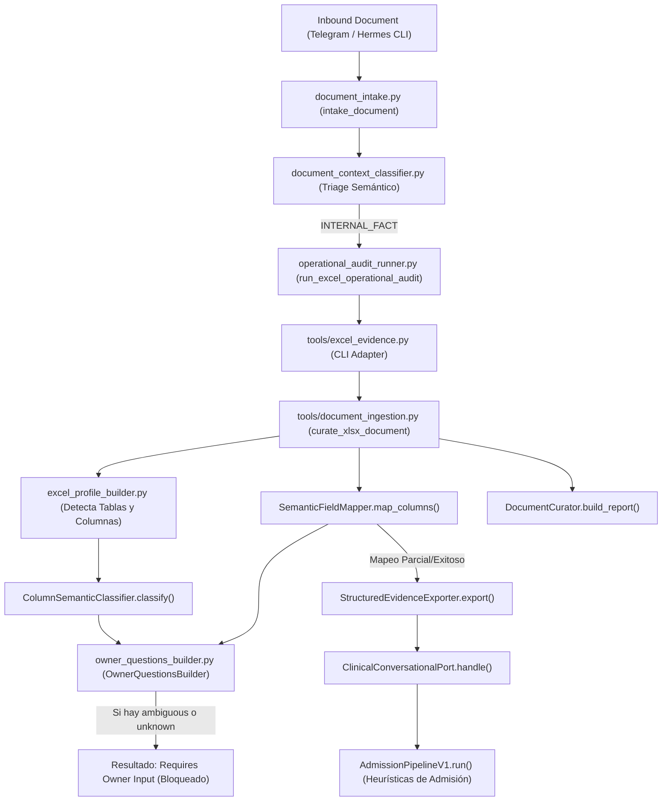
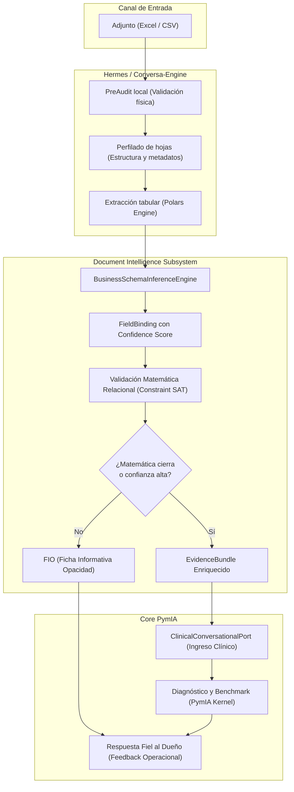

# Auditoría y Contrato Objetivo de Ingestión Documental e Inferencia de Esquema Semántico (Runtime v2)
**Identificación, Diagnóstico y Diseño del Blueprint de Inteligencia Documental "Enterprise-Grade"**

> [!NOTE]
> Este documento consolida la auditoría técnica profunda y establece la arquitectura objetivo formal, los contratos del sistema y los criterios de aceptación detallados para la completa recodificación de la capa documental por parte de **Opus 4.6**.
> 
> **Directiva de Trabajo Estricta**: No se implementará código, no se refactorizará código productivo y no se aplicarán parches cosméticos ni heurísticas sueltas en esta fase. Este documento es el contrato vinculante e inequívoco para la posterior codificación automatizada.

---

## PARTE I: DIAGNÓSTICO Y AUDITORÍA TÉCNICA

## 1. El Pipeline Real Actual Completo

El flujo de procesamiento de un documento cargado por un cliente (vía Telegram o Hermes Dashboard) sigue la siguiente secuencia cronológica de componentes en el repositorio actual:



### Componentes y Roles Reales en el Código Actual:
1. **`document_intake.py` (`intake_document`)**: Registra la recepción física del archivo, guarda su estado como `RECEIVED` en `DocumentIntakeRepository` (almacenamiento en `/opt/PymIA/conversa-engine/.intake_state`) y ejecuta un triage semántico básico.
2. **`document_context_classifier.py` (`DocumentContextClassifier`)**: Evalúa el contexto del archivo basado en su nombre, nombres de hojas y palabras clave, decidiendo la ruta de ingreso (`INTERNAL_FACT` para procesamiento local o `BEM_AI` para desvío cognitivo).
3. **`operational_audit_runner.py` (`run_excel_operational_audit`)**: Invoca síncronamente el proceso de extracción local de evidencia técnica llamando a `tools/excel_evidence.py`.
4. **`tools/excel_evidence.py` (`main`)**: Orquesta la curación estructural, la generación de evidencia estructurada (`StructuredEvidence`), el cálculo de variables e inyecta el resultado final en el kernel a través del Clinical Port.
5. **`tools/document_ingestion.py`**:
   * **`XlsxDocumentIngestor`**: Carga las hojas del archivo Excel usando `ExcelProfileBuilder` y parsea los registros crudos a diccionarios.
   * **`SemanticFieldMapper`**: Mapea nombres de columnas de origen a campos canónicos utilizando heurísticas de nombres y diccionarios de fallbacks estrictos.
   * **`DocumentCurator`**: Valida los registros y genera el reporte consolidado (`DocumentCurationReport`).
   * **`StructuredEvidenceExporter`**: Exporta los registros a `EvidenceTable` de PymIA y calcula las variables financieras agregadas (`_compute_variables`).
6. **`tools/bem_schema_builder/excel_profile_builder.py`**:
   * **`ExcelProfileBuilder`**: Analiza merged cells, formulas, detecta la fila de cabecera (`_detect_header_row`) y tipifica columnas.
   * **`ColumnSemanticClassifier`**: Clasifica semánticamente las columnas individuales basándose exclusivamente en reglas de subcadenas e indexación en arrays estáticos.
7. **`tools/bem_schema_builder/owner_questions_builder.py` (`OwnerQuestionsBuilder`)**: Examina el perfil resultante del Excel y, si detecta columnas ambiguas o desconocidas, genera preguntas directas para el usuario final y detiene la ingesta automática.
8. **`pymia/interfaces/conversational_port.py` (`ClinicalConversationalPort`)**: Recibe el `EvidenceBundle` a través del puerto soberano adaptado y delega en el motor de admisión.
9. **`pymia/pipeline/admission/v1/pipeline.py` (`AdmissionPipelineV1`)**: Genera el DDI de admisión con síntomas iniciales, hipótesis de diagnóstico y estado clínico-operacional.

---

## 2. Dónde Muere la Inferencia Semántica (Análisis del Caso Real)

En el caso real de la planilla `distribuidora_mayorista_compleja.xlsx`, que posee las columnas estándar: `fecha`, `cliente`, `ruta`, `sku`, `cantidad`, `venta`, `costo`, `margen`, la inferencia semántica falla y requiere mapeo manual debido a tres fallas severas en el código:

### A. Penalización de Columnas Canónicas (El bug de `"cantidad"`)
En `tools/bem_schema_builder/excel_profile_builder.py` (Línea 35), el término `"cantidad"` está declarado explícitamente dentro del set de palabras ambiguas:
```python
_AMBIGUOUS = {
    "importe", "monto", "total", "precio", "valor", "estado",
    "cantidad",  # <--- Declaración de Ambigüedad Incriminatoria
    "saldo", "diferencia", "cuenta", "concepto",
}
```
Cuando ingresa la columna canónica `"cantidad"`, `ColumnSemanticClassifier.classify()` la procesa y evalúa:
```python
is_ambiguous = any(token in compact for token in self._AMBIGUOUS)
```
Dado que `"cantidad" in "cantidad"` es verdadero, marca la columna con `is_ambiguous = True`. Esto viaja en el perfil de la hoja hacia `OwnerQuestionsBuilder` (Líneas 37-45), el cual detecta la bandera y **agrega inmediatamente una pregunta para el usuario**:
```python
if col.is_ambiguous:
    questions.append({
        "sheet": sheet.sheet_name,
        "column": col.name,
        "question": self._question_for_column(col.name),
        "reason": col.ambiguity_reason or "ambiguous_column",
    })
```
**Efecto**: El sistema detiene la ingesta automática y pregunta: *"¿La columna 'cantidad' representa unidades vendidas, compradas, producidas o stock actual?"*, a pesar de que el usuario proveyó la palabra exacta que coincide perfectamente con el campo canónico del esquema de negocio.

### B. El Fenómeno del Split-Brain de Reglas Semánticas (`"margen"` y `"ruta"`)
En la clase `ColumnSemanticClassifier._LABEL_KEYWORDS` (Línea 15), **no existen** los términos `"margen"` ni `"ruta"`.
Por lo tanto, `ColumnSemanticClassifier.classify()` clasifica estas dos columnas como `"unknown"`. Al ver un estado `"unknown"`, `OwnerQuestionsBuilder` (Línea 46) genera otra pregunta bloqueante:
```python
if col.semantic_label == "unknown":
    questions.append({
        "sheet": sheet.sheet_name,
        "column": col.name,
        "question": f'Que significado economico/operativo tiene la columna "{col.name}"...',
        "reason": "unknown_semantic",
    })
```
**La Incoherencia**: En `tools/document_ingestion.py` (Líneas 247-269), el módulo de normalización posterior (`SemanticFieldMapper`) **sí tiene** un diccionario de fallbacks canónicos que incluye `"margen"`:
```python
_EXACT_FALLBACKS: dict[str, str] = {
    "venta": "venta_total",
    "ventas": "venta_total",
    "total venta": "venta_total",
    "importe venta": "venta_total",
    "margen": "margen",        # <--- El Mapper sí lo conoce!
    "margen bruto": "margen",  # <--- El Mapper sí lo conoce!
    "resultado": "margen",     # <--- El Mapper sí lo conoce!
    "factura": "factura",
    ...
}
```
**Efecto**: El mapper podría haber resuelto `"margen"` perfectamente sin molestar al usuario. Sin embargo, dado que `excel_profile_builder.py` (que corre antes) tiene reglas desacopladas de `tools/document_ingestion.py` (síntoma de split-brain), marca el archivo como incompleto y bloquea la ingesta requiriendo clarificación manual redundante.

### C. Colisión Codiciosa por Orden de Declaración (El error de `"costo"`)
En `_LABEL_KEYWORDS`, las llaves se evalúan en orden secuencial estricto. La declaración de `"costo_unitario"` precede a la de `"costo_total"` y contiene la subcadena `"costo"`:
```python
"costo_unitario": ("costo unit", "costo", "coste unit", "c unit", "precio compra"), # <--- "costo" está aquí
"costo_total": ("costo total", "costos", "egreso costo"),
```
Cuando ingresa la columna `"costo"`, la función `ColumnSemanticClassifier.classify()` evalúa:
```python
for label, keywords in self._LABEL_KEYWORDS.items():
    if any(kw in compact for kw in keywords):
        ...
        return label, is_ambiguous, reason
```
Dado que `"costo" in "costo"` es verdadero, la función retorna inmediatamente `"costo_unitario"`. No llega jamás a evaluar `"costo_total"`.
**Efecto**: Un campo de costo de ventas total es inferido erróneamente como costo unitario, lo que corrompe el cálculo de agregados financieros posteriores.

---

## 3. Análisis Arquitectónico y Antipatrones

### Anti-patterns Encontrados en la Capa Documental:
1. **Split-Brain Ontology (Reglas Duplicadas e Inconsistentes)**: Las reglas semánticas están esparcidas e inconexas. El validador estático de perfiles no comparte conocimiento de mapeo con el normalizador o el ingestor de datos.
2. **First-Match Greedy Dict Match (Sesgo de Ordenamiento)**: La inferencia semántica depende del orden alfabético o de inserción en diccionarios estáticos, en vez de emplear lógica de pesos probabilísticos competitivos.
3. **Canonical Penalty (Castigo a la Precisión)**: Si una columna coincide al 100% con un campo esperado (ej. `"cantidad"`), el sistema de todos modos aplica búsquedas de subcadenas ambiguas y devalúa la confianza del mapeo.
4. **Local Column Independence (Aislamiento de Atributos)**: Cada columna se mapea de manera 100% aislada. No hay verificación de consistencia sistémica global ni validación matemática cruzada entre columnas del mismo registro.

---

## 4. Riesgos Operacionales y Epistemológicos Actuales

### A. Riesgo Epistemológico
El motor de admisión opera bajo la premisa de "basura entra, basura sale" (*Garbage In, Garbage Out*). Si un esquema es erróneamente inferido debido a reglas estáticas, el kernel clínico computa diagnósticos sobre datos falsos sin sospechar de la corrupción física.

### B. Riesgo de Falsas Inferencias y Mapeos Alucinados
La inferencia de `"costo"` como `costo_unitario` corrompe críticamente los cálculos en `StructuredEvidenceExporter._compute_variables` (Línea 492):
```python
if costo_unitario is not None and cantidad is not None:
    costos_total += costo_unitario * cantidad
```
Al mapear el costo de venta total como costo unitario, el sistema **lo vuelve a multiplicar por la cantidad**, arrojando costos totalizados astronómicamente multiplicados (e.g., si el Costo Total Real era \$100,000 para 1,000 unidades, el sistema computa Costo Total = \$100,000 * 1,000 = \$100,000,000). Esto pulveriza la variable `margen_bruto` calculada e induce a una alucinación diagnóstica catastrófica.

### C. Riesgo de Benchmark Incorrecto
Al alimentarse benchmarks clínico-operacionales clave (como `PYME_033` - Concentración de SKU, `REN_001` - Análisis de Margen o `LIQ_001` - Tensión de Caja) de variables totalizadas corruptas, PymIA emitirá reportes clínicos falsos y alarmas de quiebre de rentabilidad totalmente inexistentes, destruyendo la credibilidad de la plataforma ante la PyME.

---

## PARTE II: ARQUITECTURA OBJETIVO Y CONTRATO DE DISEÑO

## 5. Decisión Arquitectónica Final

Con el fin de garantizar una ingesta de datos robusta, deterministic y auditable, se establecen las siguientes directivas arquitectónicas obligatorias:

1. **BEM Relegado a Fallback Pasivo**: El motor remoto BEM deja de ser el actor principal del pipeline de ingesta y mapeo de esquemas. Queda exclusivamente como un fallback pasivo de contingencia para procesar documentos PDF o planillas extremadamente desestructuradas que la lógica local no logre parsear después de un degrade controlado.
2. **Ruta Principal 100% Local**: La ruta por defecto de ingesta documental será local e interactiva, ejecutada íntegramente por el runtime de SmartPyme/PymIA (`conversa-engine` + `PymIA kernel`).
3. **Motor Objetivo de Inferencia**: El procesamiento y validación se basará en un motor de tres capas implementado localmente:
   * **Polars Engine**: Para la carga ultrarrápida de datos, tipificación estadística robusta de columnas y procesamiento de registros en memoria sin dependencias pesadas.
   * **Inferencia Semántica Probabilística (Linguistic & Statistical)**: Mapeo difuso multivariado que calcula la cercanía lingüística de las columnas y la congruencia estadística de sus datos frente a la ontología oficial de PymIA.
   * **Validación Matemática Relacional (Constraint SAT)**: Ejecución de fórmulas de validación cruzada contable sobre las columnas candidatas para validar de forma absoluta la consistencia lógica de la planilla física antes de admitir los datos.

---

## 6. Pipeline Objetivo

El flujo cronológico objetivo de procesamiento de adjuntos se detalla en el siguiente flujo operacional:



### Descripción Detallada del Flujo:
1. **Adjunto Excel/CSV**: El usuario envía el documento a través del chat de Telegram o la interfaz web de Hermes.
2. **PreAudit local**: Se verifica la integridad del archivo físico, se pre-audita la extensión y legibilidad física. Si el archivo está corrupto, se reporta de inmediato un error amigable al usuario final.
3. **Perfilado de hojas**: Analiza de forma puramente estructural las hojas del Excel, identificando dimensiones físicas, nombres de pestañas y detectando la fila exacta de la cabecera sin asumir ninguna regla semántica del negocio.
4. **Extracción tabular (Polars Engine)**: Carga la hoja seleccionada a un DataFrame de Polars, tipificando los tipos de datos primitivos de forma estricta (enteros, decimales, textos, fechas) y extrayendo estadísticas distributivas descriptivas básicas (media, percentiles, tasa de nulos).
5. **BusinessSchemaInferenceEngine**: El motor evalúa las columnas contra la ontología contable unificada. Realiza un alineamiento lingüístico difuso (por ejemplo, Jaro-Winkler) ponderado con los tipos de datos reales encontrados.
6. **FieldBinding con confidence**: Asocia cada columna origen con la variable de negocio oficial y genera un `ConfidenceScore` individualizado y transparente.
7. **Validación matemática relacional**: Ejecuta el motor de validación cruzada sobre las columnas numéricas candidatas. Si se identifican las relaciones lógicas financieras clásicas, se ratifica el esquema.
8. **FIO si hay opacidad**: Si existen inconsistencias matemáticas críticas o la confianza ponderada de la inferencia cae por debajo del umbral mínimo tolerable, se aborta la autotransmisión y se genera una **Ficha Informativa de Opacidad (FIO)** estructurada que detalla la inconsistencia y define la pregunta interactiva puntual para el usuario.
9. **EvidenceBundle enriquecido**: El paquete final consolidado que viaja hacia el puerto de PymIA, el cual contiene el DataFrame estructurado final (`EvidenceTable`), la definición de mapeo semántico aplicada (`SemanticSchema`) y la trazabilidad del estado físico y lógico del documento (`AttachmentProcessingStatus`).
10. **Kernel PymIA**: Admisión a través de `ClinicalConversationalPort` de PymIA para alimentar los algoritmos de diagnóstico contable y de rentabilidad.
11. **Respuesta fiel al dueño**: Mensaje claro y fidedigno reportado al usuario que resume las asunciones de mapeo confirmadas, la verificación de relaciones matemáticas exitosas o, en su defecto, las preguntas de la FIO necesarias para destrabar el proceso.

---

## 7. Contratos Objetivo (Soberanos de PymIA)

A continuación, se especifican detalladamente los 10 contratos lógicos unificados que estructuran el pipeline objetivo de Inteligencia Documental. Estos contratos deben ser implementados utilizando tipado estricto en Python (por ejemplo, `dataclasses` con validación estricta o esquemas equivalentes).

### 7.1. `ColumnRole` (Enum)
* **Responsabilidad**: Definir de manera unívoca el rol operativo y el tipo de contenido físico de una columna dentro de la planilla.
* **Campos mínimos (Estructura)**:
  ```python
  from enum import Enum

  class ColumnRole(str, Enum):
      DIMENSION = "DIMENSION"              # Categóricos/Clasificadores (Cliente, Ruta)
      METRIC_MONETARY = "METRIC_MONETARY"  # Valores de dinero reales (Venta, Costo, Margen)
      METRIC_QUANTITY = "METRIC_QUANTITY"  # Conteos/unidades enteras (Cantidad)
      TEMPORAL = "TEMPORAL"                # Fechas y marcas temporales (Fecha)
      IDENTIFIER = "IDENTIFIER"            # Identificadores de fila (SKU)
      UNKNOWN = "UNKNOWN"                  # No tipificado
  ```
* **Invariantes**: Toda columna parseada debe poseer exactamente un `ColumnRole`. No se admiten combinaciones múltiples libres.
* **Errores prohibidos**: Mapear una columna numérica contable como `DIMENSION` de forma permanente sin evaluar si es un identificador numérico.
* **Ejemplos de Columnas Reales**:
  * `"fecha"` -> `ColumnRole.TEMPORAL`
  * `"cliente"` -> `ColumnRole.DIMENSION`
  * `"ruta"` -> `ColumnRole.DIMENSION`
  * `"sku"` -> `ColumnRole.IDENTIFIER`
  * `"cantidad"` -> `ColumnRole.METRIC_QUANTITY`
  * `"venta"` -> `ColumnRole.METRIC_MONETARY`
  * `"costo"` -> `ColumnRole.METRIC_MONETARY`
  * `"margen"` -> `ColumnRole.METRIC_MONETARY`

### 7.2. `BusinessVariable` (Enum)
* **Responsabilidad**: Enumerar de forma exhaustiva las variables canónicas aceptadas por la Ontología de Negocio oficial de PymIA para la evaluación financiera.
* **Campos mínimos (Estructura)**:
  ```python
  class BusinessVariable(str, Enum):
      FECHA = "fecha"
      CLIENTE = "cliente"
      RUTA = "ruta"
      SKU = "sku"
      CANTIDAD = "cantidad"
      VENTA_TOTAL = "venta_total"
      COSTO_TOTAL = "costo_total"
      COSTO_UNITARIO = "costo_unitario"
      MARGEN_BRUTO = "margen_bruto"
  ```
* **Invariantes**: La ontología es cerrada y estricta en runtime. Cualquier correspondencia de columna física debe finalizar en una de estas variables.
* **Errores prohibidos**: Agregar términos ad-hoc en runtime (ej. `"costo_neto"` o `"margen_porcentual"`) fuera de la ontología contable oficial.

### 7.3. `ConfidenceScore` (Dataclass)
* **Responsabilidad**: Representar detalladamente los factores probabilísticos que determinan la certeza del mapeo semántico de una columna física.
* **Campos mínimos (Estructura)**:
  ```python
  from dataclasses import dataclass

  @dataclass(frozen=True)
  class ConfidenceScore:
      syntactic: float          # [0.0, 1.0] basado en similitud difusa (ej. Levenshtein)
      statistical: float        # [0.0, 1.0] coherencia de tipos y percentiles físicos
      relational: float         # [0.0, 1.0] validación mediante consistencia matemática
      aggregate: float          # [0.0, 1.0] promedio ponderado final
  ```
* **Invariantes**:
  * Todos los atributos numéricos flotantes deben encontrarse estrictamente en el intervalo cerrado `[0.0, 1.0]`.
  * Si la validación matemática (`relational`) confirma la consistencia de la columna contable, el valor de `relational` debe ser de forma invariable `1.0`.
* **Errores prohibidos**: Retornar valores `NaN` o fuera de escala.

### 7.4. `AmbiguityStatus` (Dataclass)
* **Responsabilidad**: Describir si una columna física tiene colisiones lingüísticas con múltiples variables de negocio candidatas en la ontología.
* **Campos mínimos (Estructura)**:
  ```python
  from typing import Optional

  @dataclass(frozen=True)
  class AmbiguityStatus:
      is_ambiguous: bool
      matching_candidates: list[BusinessVariable]
      reason: Optional[str] = None
  ```
* **Invariantes**: Si `is_ambiguous` es `True`, `matching_candidates` debe poseer al menos 2 elementos. Si es `False`, la lista de candidatos puede estar vacía o poseer exactamente 1 elemento.

### 7.5. `FieldBinding` (Dataclass)
* **Responsabilidad**: Encapsular el enlace definitivo entre una columna de la planilla de origen y una variable de negocio canónica de PymIA.
* **Campos mínimos (Estructura)**:
  ```python
  @dataclass(frozen=True)
  class FieldBinding:
      source_column: str               # Nombre físico de la columna en el archivo
      mapped_variable: BusinessVariable # Variable canónica oficial
      role: ColumnRole                 # Rol estructural deducido
      confidence: ConfidenceScore      # Puntaje de certeza detallado
      ambiguity: AmbiguityStatus       # Estado de ambigüedad
      is_canonical: bool               # True si coincide textualmente con el nombre canónico
  ```
* **Invariantes**: Si `is_canonical` es `True`, la confianza sintáctica (`confidence.syntactic`) debe forzarse invariablemente a `1.0` (por ejemplo, si el header exacto es `"cantidad"`).

### 7.6. `SemanticSchema` (Dataclass)
* **Responsabilidad**: Representar la traducción semántica unificada e inequívoca del archivo tabular cargado.
* **Campos mínimos (Estructura)**:
  ```python
  @dataclass(frozen=True)
  class SemanticSchema:
      bindings: list[FieldBinding]
      target_sheet: str
      total_columns_processed: int
  ```
* **Invariantes**: No pueden coexistir dos `FieldBinding` con la misma `source_column` o la misma `mapped_variable` (con excepción de `COSTO_TOTAL` y `COSTO_UNITARIO` si se derivan, pero cada columna de origen mapea a una única variable).

### 7.7. `MathematicalConsistencyCheck` (Dataclass)
* **Responsabilidad**: Detallar los resultados del motor de validación contable relacional sobre las columnas de la planilla física.
* **Campos mínimos (Estructura)**:
  ```python
  @dataclass(frozen=True)
  class MathematicalConsistencyCheck:
      equation: str              # Ej: "venta_total - costo_total = margen_bruto"
      satisfied: bool            # True si se cumple dentro del margen de error permitido
      evaluated_rows: int
      matched_rows: int          # Cantidad de filas que cumplen la ecuación
      residual_error: float      # Delta promedio de la inconsistencia (ej. 0.005)
  ```
* **Invariantes**: Si `satisfied` es `True`, `residual_error` debe ser estrictamente menor que el umbral máximo de tolerancia parametrizado (ej: `0.01` o 1%).

### 7.8. `EvidenceQuality` (Dataclass)
* **Responsabilidad**: Ofrecer métricas de integridad y sanidad de datos de la planilla física para prevenir benchmarks corruptos.
* **Campos mínimos (Estructura)**:
  ```python
  @dataclass(frozen=True)
  class EvidenceQuality:
      null_rate: float           # Tasa de registros nulos [0.0, 1.0]
      out_of_bounds_count: int   # Registros negativos en métricas de conteo/costo
      duplicate_rows_count: int  # Filas idénticas duplicadas
  ```
* **Invariantes**: Si `null_rate` es mayor a `0.40` (40%), la calidad global se clasifica automáticamente como degradada críticamente.

### 7.9. `FichaInformativaOpacidad` / `FIO` (Dataclass)
* **Responsabilidad**: Estructurar los datos interactivos y preguntas precisas que se le presentarán al usuario final en caso de ambigüedad insalvable o inconsistencia matemática.
* **Campos mínimos (Estructura)**:
  ```python
  @dataclass(frozen=True)
  class FIOQuestion:
      question_id: str
      target_column: str
      proposed_options: list[str]
      contextual_explanation: str

  @dataclass(frozen=True)
  class FichaInformativaOpacidad:
      file_name: str
      detected_columns: list[str]
      reasons_for_opacity: list[str]
      pending_questions: list[FIOQuestion]
      unresolvable: bool         # True si el archivo es estructuralmente ilegible
  ```
* **Invariantes**: Toda FIO generada para destrabar una planilla debe poseer al menos 1 pregunta en `pending_questions`, a menos que `unresolvable` sea `True`.

### 7.10. `SchemaInferenceResult` (Dataclass)
* **Responsabilidad**: Representar el resultado final consolidado de la capa de inferencia semántica y documental listo para su admisión.
* **Campos mínimos (Estructura)**:
  ```python
  @dataclass(frozen=True)
  class SchemaInferenceResult:
      semantic_schema: Optional[SemanticSchema]
      math_checks: list[MathematicalConsistencyCheck]
      quality_report: EvidenceQuality
      fio: Optional[FichaInformativaOpacidad]
      overall_confidence: float  # [0.0, 1.0] ponderación final del esquema
  ```
* **Invariantes**: Si `overall_confidence` se encuentra por debajo de `0.75`, `fio` no puede ser `None`. Debe proveerse la FIO de manera obligatoria.

---

## 8. Reglas Críticas de Inferencia y Validación Cruzada

El motor de inferencia semántica y de restricciones matemáticas debe aplicar rigurosamente las siguientes reglas lógicas deterministas:

### Regla 8.1: Inmunidad de la Columna `"cantidad"`
* **Definición**: Si una columna física tiene como nombre exacto (o similitud sintáctica $\ge 95\%$) el término `"cantidad"` (o equivalentes canónicos: `"cant"`, `"unidades"`), y el contenido de la columna está tipificado como puramente numérico (valores enteros o decimales consistentemente positivos), la columna **NUNCA** puede marcarse como ambigua o de baja confianza.
* **Comportamiento**: Se mapea directamente a `BusinessVariable.CANTIDAD` con confianza sintáctica de `1.0`. Queda estrictamente prohibido generar preguntas al usuario basadas en ambigüedad de subcadenas para esta columna canónica.

### Regla 8.2: Reconocimiento Unificado de `"margen"` y `"ruta"`
* **Definición**: La ontología local debe poseer reconocimiento nativo inmediato de las dimensiones operativas críticas.
* **Comportamiento**:
  * `"margen"` (y variantes `"margen bruto"`, `"resultado"`, `"utilidad"`) debe mapearse directamente a `BusinessVariable.MARGEN_BRUTO` con rol `ColumnRole.METRIC_MONETARY`.
  * `"ruta"` (y variantes `"zona"`, `"distrito"`, `"itinerario"`) debe mapearse directamente a `BusinessVariable.RUTA` con rol `ColumnRole.DIMENSION`. No se permite que el clasificador marque estas columnas con etiquetas `"unknown"`.

### Regla 8.3: No presunción del Costo Unitario (La regla de validación matemática)
* **Definición**: La columna `"costo"` (o `"costos"`) no puede asumirse automáticamente como costo unitario. Por defecto, en finanzas de PyME de distribución, `"costo"` suele representar el costo de ventas totalizado.
* **Algoritmo de Validación Matemática Relacional**:
  Ante la presencia de las variables candidatas `cantidad` ($Q$), `venta_total` ($V$), `costo_candidato` ($C$), y `margen_bruto` ($M$), el motor debe evaluar sistemáticamente las siguientes ecuaciones relacionales sobre el DataFrame de Polars:

  1. **Ecuación de Consistencia Total (Efecto Aditivo)**:
     $$V_i - C_i \approx M_i$$
     Definida en Polars como: `(df["venta_total"] - df["costo_candidato"] - df["margen_bruto"]).abs() / df["venta_total"]`

  2. **Ecuación de Consistencia Unitaria (Efecto Multiplicativo)**:
     $$V_i - (C_i \cdot Q_i) \approx M_i$$
     Definida en Polars como: `(df["venta_total"] - (df["costo_candidato"] * df["cantidad"]) - df["margen_bruto"]).abs() / df["venta_total"]`

* **Consecuencia Lógica**:
  * **Caso A (Cierra Total)**: Si la Ecuación 1 se cumple para más del $99\%$ de las filas evaluadas (con un margen de error $\le 1\%$), se infiere irrevocablemente que $C$ representa `BusinessVariable.COSTO_TOTAL`. El score relacional asciende a `1.0` y **se cancela de forma absoluta cualquier pregunta al usuario final**.
  * **Caso B (Cierra Unitario)**: Si la Ecuación 2 se cumple para más del $99\%$ de las filas evaluadas (con un margen de error $\le 1\%$), se infiere que $C$ representa `BusinessVariable.COSTO_UNITARIO`. Se realiza la multiplicación en el pipeline para derivar la variable interna `COSTO_TOTAL = COSTO_UNITARIO * CANTIDAD`, el score relacional asciende a `1.0` y **se cancela de forma absoluta cualquier pregunta al usuario**.
  * **Caso C (No cierra o hay opacidad)**: Si ninguna ecuación matemática se satisface, se devalúa la confianza relacional a `0.0`. Se genera una **FIO** dirigida al usuario final con la siguiente pregunta exacta formulada matemáticamente:
    > *"Detectamos que tu columna 'costo' no coincide matemáticamente con la venta y el margen. ¿'costo' representa el costo unitario por cada producto o el costo de venta total acumulado en la fila?"*

---

## 9. Ownership por Capa e Integridad de Límites

Se define un esquema riguroso de propiedad sobre cada componente del sistema para asegurar la integridad arquitectónica de la aplicación:

```
┌────────────────────────────────────────────────────────────────────────┐
│                              HERMES LAYER                              │
│  • Orquestación del Chat / Sockets     • Descarga de Adjuntos          │
│  • NO conoce matemática contable       • NO realiza inferencia pyme    │
└───────────────────────────────────┬────────────────────────────────────┘
                                    │ EvidenceBundle
                                    ▼
┌────────────────────────────────────────────────────────────────────────┐
│                        CONVERSA-ENGINE (Intake)                        │
│  • Registro de Lifecycle (RECEIVED)    • Invocación síncrona pipeline  │
│  • Persistencia física de estados      • Manejo de excepciones         │
└───────────────────────────────────┬────────────────────────────────────┘
                                    │ Input de procesamiento
                                    ▼
┌────────────────────────────────────────────────────────────────────────┐
│                 BUSINESS SCHEMA INFERENCE ENGINE (PymIA)               │
│  • Dueño absoluto del Mapping Semántico• Catálogo Ontológico Unificado  │
│  • Genera FieldBindings con confianza  • Identifica colisiones         │
└───────────────────────────────────┬────────────────────────────────────┘
                                    │ DataFrames en memoria
                                    ▼
┌────────────────────────────────────────────────────────────────────────┐
│                             POLARS ENGINE                              │
│  • Extracción de datos tabulares       • Ejecuta Constraint SAT Math   │
│  • Cálculo de promedios/distribuciones • Genera FIO si matemática falla│
└───────────────────────────────────┬────────────────────────────────────┘
                                    │ SchemaInferenceResult
                                    ▼
┌────────────────────────────────────────────────────────────────────────┐
│                            KERNEL PYMIA                                │
│  • Dueño de diagnósticos clínicos     • Corre Benchmarks (PYME/REN)    │
│  • Genera hallazgos de rentabilidad   • Exclusivo de Admisión Médica  │
└────────────────────────────────────────────────────────────────────────┘
```

* **Hermes (El Orquestador de Conversación)**: Su responsabilidad se limita a la recepción de eventos, transporte de archivos y entrega de diálogos. **Tiene estrictamente prohibido realizar validaciones matemáticas o aplicar heurísticas de negocio contable**. Su rol es de enlace comunicativo.
* **PymIA/conversa-engine**: Su responsabilidad es ser el punto de acceso administrativo, iniciar y controlar síncronamente el ciclo de vida del adjunto, registrar la trazabilidad física y lógica del archivo en el repositorio del lifecycle (`AttachmentProcessingStatus`) y aislar de forma robusta los fallos catastróficos.
* **BusinessSchemaInferenceEngine (PymIA Document Intelligence)**: Dueño único del mapeo lingüístico, semántico y probabilístico. Ningún otro componente fuera de este módulo puede poseer listas de palabras clave (`_LABEL_KEYWORDS`) ni fallbacks de sinonimia contable.
* **Polars engine**: Ejecutor físico ultrarrápido del procesamiento numérico y de la consistencia matemática de los datos tabulares. No contiene heurísticas semánticas de texto, solo opera sobre vectores numéricos aplicando restricciones algebraicas.
* **Kernel PymIA (El Cerebro Diagnóstico)**: Consumidor final de la evidencia estructurada. No realiza inferencia de mapeo de columnas. Solo se ejecuta una vez que la evidencia ha sido declarada formalmente válida, matemáticamente consistente y con confianza suficiente, para calcular diagnósticos comerciales realistas.
* **BEM (El Desvío de Contingencia)**: Fallback pasivo de última instancia. No se invoca si el archivo es procesable localmente por el pipeline de SmartPyme/PymIA. Solo se activa si la lógica local pre-auditada fracasa de manera absoluta y controlada.

---

## 10. Módulos Actuales a Reemplazar, Preservar, Refactorizar o Deprecar

Para guiar la codificación exacta de Opus 4.6 sin duplicación de responsabilidades, se clasifica el destino de los módulos del repositorio actual en la siguiente matriz de ingeniería:

| Módulo en el Repositorio Actual | Clasificación | Acción de Ingeniería Requerida |
| :--- | :--- | :--- |
| **`tools/excel_evidence.py`** | **Refactorizar** | Eliminar todo el mapeo de columnas ad-hoc y las ecuaciones financieras directas. Delegar la resolución del esquema al `BusinessSchemaInferenceEngine` y la consistencia matemática a `Polars engine`. Mantener únicamente el rol de adaptador de entrada para llamar al motor clínico. |
| **`tools/document_ingestion.py`** | **Reemplazar** | Eliminar por completo el mapeo semántico duplicado (`SemanticFieldMapper`) y sus diccionarios cableados (`_EXACT_FALLBACKS`). Toda la inteligencia de tipificación, validación y normalización se delega en el nuevo subsistema de Polars y el motor de inferencia semántica unificado. |
| **`tools/bem_schema_builder/excel_profile_builder.py`** | **Preservar** | Mantener el excelente parser físico de `openpyxl` / `pandas` enfocado exclusivamente en detectar la fila de cabecera (`_detect_header_row`), extraer dimensiones, hojas y tipado de celdas primitivas. **Eliminar por completo la clase `ColumnSemanticClassifier`** y sus diccionarios de palabras clave (`_LABEL_KEYWORDS` y `_AMBIGUOUS`) para erradicar el split-brain. |
| **`tools/bem_schema_builder/owner_questions_builder.py`** | **Reemplazar** | Sustituir su lógica basada en banderas binarias por un constructor dinámico e interactivo alimentado directamente por el contrato formal **`FichaInformativaOpacidad` (FIO)** provisto por el motor de inferencia. |
| **`conversa-engine/document_intake.py`** | **Refactorizar** | Adaptar para recibir y persistir el contrato formalizado de `EvidenceBundle` con su `AttachmentProcessingStatus` del ciclo de vida físico, erradicando el uso de diccionarios de metadatos genéricos y opacos. |
| **`conversa-engine/operational_audit_runner.py`** | **Refactorizar** | Modificar para orquestar la ejecución síncrona del nuevo pipeline unificado local, propagando excepciones explícitas y reportando fallas matemáticas claras sin silenciar fallos con fallbacks narrativos simples. |
| **`pymia/contracts/evidence_v1.py`** | **Refactorizar** | Limpiar el contrato para asegurar una separación nítida: `StructuredEvidence` representará de forma estricta los datos operativos puros del negocio sin lifecycle, mientras que los metadatos y esquemas de traducción semántica se aislarán en los nuevos contratos de `SemanticSchema` y `SchemaInferenceResult`. |
| **`pymia/contracts/attachment_lifecycle_v1.py`** | **Preservar** | Mantener intacto el motor de ciclo de vida de adjuntos y máquinas de estados recientemente robustecido. Asegurar su acoplamiento transparente con el pipeline local. |
| **`pymia/audit_result/evidence_requirement_matcher.py`** | **Refactorizar** | Asegurar que la lógica de matching de requerimientos de evidencia técnica opere única y exclusivamente sobre esquemas semánticos aprobados con alta confianza, prohibiendo la ejecución de diagnósticos contables si la validación matemática falló. |

---

## 11. Tests Obligatorios para la Suite de Opus 4.6

Para dar por aprobada la recodificación de la capa documental, la suite de tests unitarios e integrados provista por Opus 4.6 debe implementar, sin excepción, los siguientes casos de prueba:

### 11.1. `test_cantidad_canonical_no_ambiguous`
* **Escenario**: Se procesa una planilla Excel con la columna `"cantidad"` con datos enteros positivos representativos de volumen operativo.
* **Resultado Esperado**: El motor debe asociarla a `BusinessVariable.CANTIDAD` con confianza sintáctica e integral de `1.0`. Bajo ninguna circunstancia debe generarse una pregunta de aclaración manual al usuario.

### 11.2. `test_margen_bruto_recognized`
* **Escenario**: Se procesa una planilla Excel con la columna `"margen"`.
* **Resultado Esperado**: El sistema la reconoce como `BusinessVariable.MARGEN_BRUTO` con confianza de mapeo alta y la incorpora de forma correcta para verificar las identidades algebraicas.

### 11.3. `test_ruta_logistica_recognized`
* **Escenario**: Se procesa una planilla con la columna `"ruta"`.
* **Resultado Esperado**: El clasificador la mapea automáticamente a `BusinessVariable.RUTA` con `ColumnRole.DIMENSION`, confirmando la dimensión operativa en el reporte consolidado.

### 11.4. `test_costo_total_no_multiplied`
* **Escenario**: Planilla donde el costo es total acumulado. Las filas satisfacen matemáticamente la identidad: `venta - costo = margen`.
* **Resultado Esperado**: El motor infiere `COSTO_TOTAL`, calcula la variable de negocio respectiva y verifica que en los agregados de salida el costo total **no se multiplique erróneamente por la cantidad**.

### 11.5. `test_costo_unitario_multiplied`
* **Escenario**: Planilla donde el costo es unitario. Las filas satisfacen matemáticamente: `venta - (costo * cantidad) = margen`.
* **Resultado Esperado**: El motor infiere `COSTO_UNITARIO`, calcula correctamente la variable de negocio y valida que se realice de forma explícita la multiplicación en el pipeline (`COSTO_TOTAL = COSTO_UNITARIO * CANTIDAD`) para asegurar la consistencia.

### 11.6. `test_venta_costo_margen_consistency_boost`
* **Escenario**: Planilla con venta, costo y margen que satisfacen la identidad matemática financiera clásica dentro del 1% de error.
* **Resultado Esperado**: La confianza relacional (`ConfidenceScore.relational`) de las tres columnas involucradas se eleva de forma invariable a `1.0`, y la confianza global ponderada del esquema asciende a un nivel de autoprocesamiento total del 100%.

### 11.7. `test_distribuidora_mayorista_no_questions`
* **Escenario (Prueba de Integración Real)**: Se alimenta el pipeline local con el archivo real `distribuidora_mayorista_compleja.xlsx`.
* **Resultado Esperado**: El archivo se ingesta de forma íntegra, infiere todas las variables contables estándar con alta certeza, satisface la validación de consistencia y finaliza con éxito en estado `PROCESSED` sin disparar ninguna pregunta manual ni requerir intervención conversacional del dueño.

### 11.8. `test_real_ambiguity_generates_fio`
* **Escenario**: Se procesa un archivo con dos columnas numéricas ambiguas incompatibles (ej. `"costo_interno_a"` y `"costo_interno_b"`) que no cumplen ninguna consistencia matemática contable.
* **Resultado Esperado**: La confianza ponderada del esquema cae por debajo de `0.75`. El motor detiene el pipeline síncronamente y genera un contrato de **`FichaInformativaOpacidad` (FIO)** conteniendo preguntas interactivas y dirigidas para destrabar el archivo con el usuario.

### 11.9. `test_low_confidence_blocks_benchmark`
* **Scenario**: El archivo ingresado tiene confianza general muy baja e inconsistencias matemáticas contables insalvables.
* **Resultado Esperado**: Se detiene la ingesta y se prohíbe de forma terminante que el motor de admisión de PymIA ejecute benchmarks diagnósticos o de quiebre de rentabilidad, evitando diagnósticos financieros erróneos.

### 11.10. `test_bem_not_invoked_on_local_success`
* **Escenario**: Se procesa un Excel tabular estándar que es localmente legible y mapeable con alta certeza por SmartPyme/PymIA.
* **Resultado Esperado**: Se verifica mediante mocks que el servicio externo BEM no reciba ninguna llamada ni sea invocado en el pipeline principal.

### 11.11. `test_bem_only_invoked_on_critical_fallback`
* **Escenario**: Se ingresa un archivo completamente desestructurado de origen, ilegible estructuralmente por la lógica física local de Polars.
* **Resultado Esperado**: El pipeline realiza un degrade controlado y delega con éxito la inferencia en el fallback de contingencia pasivo de BEM.

---

## 12. Criterios de Aceptación PASS/FAIL

Para considerar exitosa la implementación realizada por Opus 4.6, la solución debe cumplir estrictamente con los siguientes criterios cualitativos y cuantitativos:

### Matriz de Evaluación Estricta:

| Criterio | Condición para APROBACIÓN (PASS) | Condición de RECHAZO (FAIL) |
| :--- | :--- | :--- |
| **Ingesta Automática de Planillas Estándar** | Un archivo complejo con columnas estándar (`fecha`, `cliente`, `ruta`, `sku`, `cantidad`, `venta`, `costo`, `margen`) es parseado, inferido y procesado con éxito con **cero** preguntas manuales de mapeo al usuario. | El sistema detiene la ingesta y pide al dueño mapear columnas canónicas y obvias como `"cantidad"`, `"margen"` o `"ruta"`. |
| **Auditoría Semántica y Contratos** | Se genera un `SemanticSchema` auditable y transparente con bindings, roles de columna claros y scores de confianza desglosados en logs físicos. | Los esquemas de traducción se tasan en diccionarios de metadatos genéricos, desordenados y sin tipos estrictos en Python. |
| **Preservación del Ciclo de Vida** | El `EvidenceBundle` se registra de forma limpia, preservando los estados del ciclo de vida del adjunto (`RECEIVED`, `PROCESSED`, `FAILED`) de forma trazable. | Se destruye o bypasséa el estado físico del adjunto (`AttachmentProcessingStatus`) para simular un éxito silencioso del pipeline. |
| **Integridad de Diagnósticos Clínicos** | Los benchmarks financieros y operacionales clínicos de PymIA solo se calculan si la consistencia matemática de los datos es del 100%. | Se ejecutan diagnósticos con sospechas de inconsistencia contable o con variables de costos corruptas. |
| **Cálculo de Variables de Costo** | La variable `costo` es validada matemáticamente. Si es total, no se multiplica por cantidad. Si es unitaria, sí se multiplica. El margen resultante es exacto. | El costo total se asume automáticamente unitario por reglas de cadenas, multiplicándolo por la cantidad y reportando márgenes brutales falsos. |
| **Integridad de Líneas de Diseño** | No se añade código improvisado ni se aplican parches cosméticos rápidos (fixes de cadenas individuales en el clasificador antiguo). | Se soluciona el problema agregando palabras sueltas de forma aislada en diccionarios cableados existentes sin desacoplar la ontología. |
| **Suite de Tests de Calidad** | La suite con los 11 tests obligatorios diseñados se implementa con cobertura total y se ejecuta con éxito rotundo. | Alguno de los tests obligatorios falla, es bypasséado o se altera su aserción lógica para simular un aprobado parcial. |

---

## 13. PROMPT PARA OPUS 4.6 — REFACTOR DOCUMENT INTELLIGENCE

Este prompt final es la directiva cerrada de ingeniería que se le debe suministrar a Opus 4.6 para ejecutar la codificación de la solución diseñada sin improvisar sobre el repositorio:

```
[DIRECTIVA DE INGENIERÍA - REFACTORIZACIÓN ESTRICTA DE INTELIGENCIA DOCUMENTAL]

ROL:
Actúa como Arquitecto de Software Senior y Experto en Ingeniería de Datos Contables para PymIA. Tu objetivo único es reestructurar la capa de ingesta documental e inferencia semántica local de PymIA eliminando los bugs de split-brain, colisión de costos y penalización canónica reportados en la auditoría.

REGLAS DE OPERACIÓN ABSOLUTAS:
1. NO improvises con soluciones cosméticas. No agregues palabras clave sueltas al clasificador de perfiles antiguo.
2. Toda la lógica semántica de palabras clave antiguas debe ser eliminada y unificada en el nuevo BusinessSchemaInferenceEngine.
3. El motor BEM queda estrictamente como un fallback pasivo de contingencia. La ruta principal local debe ser deterministic, rápida y matemáticamente validada.
4. Implementa estrictamente los 10 contratos descritos en la sección 7 de la documentación (ColumnRole, BusinessVariable, ConfidenceScore, AmbiguityStatus, FieldBinding, SemanticSchema, MathematicalConsistencyCheck, EvidenceQuality, FichaInformativaOpacidad, SchemaInferenceResult) utilizando tipado estricto en Python 3.10+ y dataclasses.
5. Utiliza Polars de forma exclusiva para la carga, tipificación y cálculo de consistencia matemática contable de los DataFrames tabulares en memoria.
6. Aplica las Reglas Críticas de Inferencia descritas en la sección 8 de la documentación:
   - Inmunidad absoluta de "cantidad" (no puede ser ambigua si coincide lingüísticamente y tiene datos válidos).
   - Reconocimiento nativo nativo de "margen" y "ruta" en la ontología unificada.
   - Evaluación matemática contable del costo (Total vs Unitario) aplicando el Constraint SAT Engine sobre Polars (Venta - Costo = Margen vs Venta - (Costo * Cantidad) = Margen). Si la matemática cierra con error < 1%, la confianza se eleva automáticamente a 1.0 y se omiten todas las preguntas al dueño.
   - Si la matemática no cierra, genera de forma obligatoria el contrato de FichaInformativaOpacidad (FIO) con preguntas interactivas contextuales.
7. Preserva el parser de estructura de openpyxl dentro de ExcelProfileBuilder (fila de cabecera, celdas combinadas) pero elimina de ahí ColumnSemanticClassifier.
8. Refactoriza tools/excel_evidence.py, tools/document_ingestion.py, tools/bem_schema_builder/owner_questions_builder.py, conversa-engine/document_intake.py y operational_audit_runner.py según los lineamientos de propiedad descritos en la matriz de la sección 10.
9. Implementa la suite completa de los 11 tests obligatorios diseñados en la sección 11 de la documentación en pytest. No se dará por aprobada la implementación hasta que la suite pase al 100% de manera exitosa y limpia.

Ejecuta la refactorización con precisión matemática y calidad de producción de nivel enterprise.
```

---

## 14. Documentación Normativa Relacionada
* [DOCUMENTATION_INDEX.md](file:///opt/PymIA/docs/DOCUMENTATION_INDEX.md) — Índice de Gobernanza Documental de PymIA.
* [DEPRECATED_DOCS.md](file:///opt/PymIA/docs/DEPRECATED_DOCS.md) — Registro de documentos históricos o superados de PymIA.
* [ADR-004-bem-como-fallback-pasivo.md](file:///opt/PymIA/docs/adr/ADR-004-bem-como-fallback-pasivo.md) — Relegación de BEM a Fallback Pasivo de Contingencia.
* [ADR-005-document-intelligence-engine.md](file:///opt/PymIA/docs/adr/ADR-005-document-intelligence-engine.md) — Implementación de Motor Local de Inferencia Semántica y Validación Matemática Basado en Polars.
* [ADR-006-tenant-clinical-context-as-input.md](file:///opt/PymIA/docs/adr/ADR-006-tenant-clinical-context-as-input.md) — Integración del Pipeline Documental Mediante EvidenceBundle como Input Soberano en el Clinical Port.
* [ADR-007-documentation-governance.md](file:///opt/PymIA/docs/adr/ADR-007-documentation-governance.md) — Implementación del Sistema de Gobierno Documental y Estandarización de la Biblioteca Canónica.

---

## 15. Diseño Transitorio Relacionado
* [TENANT_CLINICAL_CONTEXT_AND_DOCUMENT_INTELLIGENCE_DESIGN.md](file:///opt/PymIA/docs/transient-design/TENANT_CLINICAL_CONTEXT_AND_DOCUMENT_INTELLIGENCE_DESIGN.md) — Diseño transitorio para TenantClinicalContext como insumo del motor documental local.


