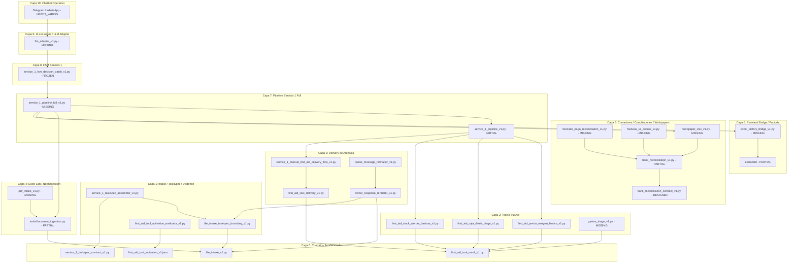

# SERVICE_1_FULL_LAYERED_IMPLEMENTATION_TRACE_V1

## Estado

```text
Tipo: PRODUCT_TRACE / MASTER_IMPLEMENTATION_AUDIT
Estado: MASTER_APPLIED
Runtime impact: NONE
Code impact: NONE
Tests impact: NONE
Commit autorizado: NO
Push autorizado: NO
```

## Propósito

Este documento fija de forma rigurosa la traza maestra de implementación por capas de **Servicio 1 Full** a partir de la verdad fáctica del repositorio y la evidencia documental, eliminando cualquier tipo de desactualización, supuestos de valor o derivas hacia MVPs o pilotos comerciales.

Servicio 1 no se reduce a First Aid: es un sistema completo determinístico e integrado de datos, Excel y contabilidad para la PyME, con chatbot conversacional arneado.

---

## Fuentes leídas / autoridad usada

*   [Pymia-memoria/_estado_actual.md](file:///e:/BuenosPasos/smartbridge/PymIA/Pymia-memoria/_estado_actual.md)
*   [Pymia-memoria/_task_actual.md](file:///e:/BuenosPasos/smartbridge/PymIA/Pymia-memoria/_task_actual.md)
*   [Pymia-memoria/_decisiones_vigentes.md](file:///e:/BuenosPasos/smartbridge/PymIA/Pymia-memoria/_decisiones_vigentes.md)
*   [Pymia-memoria/_no_volver_a_hacer.md](file:///e:/BuenosPasos/smartbridge/PymIA/Pymia-memoria/_no_volver_a_hacer.md)
*   [docs/producto/PYMIA_SERVICE_1_FULL_CATALOG_V1.md](file:///e:/BuenosPasos/smartbridge/PymIA/docs/producto/PYMIA_SERVICE_1_FULL_CATALOG_V1.md)
*   [docs/producto/PYMIA_SERVICE_1_CAPABILITY_MATRIX_V2.md](file:///e:/BuenosPasos/smartbridge/PymIA/docs/producto/PYMIA_SERVICE_1_CAPABILITY_MATRIX_V2.md)
*   [docs/producto/SERVICE_1_DEVELOPMENT_AUDIT_AND_COMPLETION_ROADMAP_V1.md](file:///e:/BuenosPasos/smartbridge/PymIA/docs/producto/SERVICE_1_DEVELOPMENT_AUDIT_AND_COMPLETION_ROADMAP_V1.md)

---

## 1. VEREDICT (Veredicto de Auditoría)

```text
SERVICE_1_FULL_STATUS: PARTIAL_SYSTEM_IMPLEMENTED / DRIFT_IDENTIFIED
```

### Diagnóstico de la Traza Maestra
1.  **Estado Implementado:** Se encuentra completamente cerrada y validada la cadena de **Primeros Auxilios (First Aid) asistido y manual**. La capa de contratos base (Capa 0), ingesta y normalización de valores (Capa 1), lógica de herramientas core (Capa 2), renderizado y formateo de respuesta (Capa 3), exportación física openpyxl (Capa 4), y orquestación del arnés del operador (`service_1_pipeline_v1`, `service_1_operator_harness_v1`, `service_1_operator_delivery_package_v1` en Capa 5) están **100% operacionales**.
2.  **Estado Parcial:**
    *   **Laboratorio Excel / Ingesta Semántica:** El pipeline de curación `document_ingestion.py` reside como script aislado bajo `tools/`, sin estar integrado formalmente en el runtime del pipeline de Servicio 1.
    *   **Factoría Excel (Exceland):** El compilador de specs YAML y warehouse de templates en `exeland2` funciona de manera autónoma, pero no existe el bridge de conexión para que PymIA-Live invoque la generación física.
    *   **Conciliación Bancaria:** Existe la lógica de conciliación genérica en el kernel histórico y templates con macros en exeland2, pero sin un contrato o módulo integrado.
3.  **Estado Faltante (Missing):** Ingesta de PDF, conciliación de Mercado Pago / tarjetas, facturas contra cobros, papeles de trabajo (`workpapers`), liquidación IVA/IIBB, generación de asientos para ERP, máquina de estados FSM productiva, adaptador LLM (IA arneada) y cableado del chatbot Telegram al pipeline.
4.  **Desactualización Documental Detectada:** Existe una discrepancia significativa entre los documentos maestros (`FULL_CATALOG_V1`, `CAPABILITY_MATRIX_V2` y `ROADMAP_V1`) y el código real. Los documentos colocan componentes cruciales como `precio_margen_basico`, `caja_diaria_triage`, `stock_alertas_basicas`, `xlsx_delivery`, `pipeline_v1` y `taskspec_assembler` en estado `DOCUMENTED_ONLY` o `DEFINED`. Sin embargo, todos estos componentes están **físicamente implementados, validados y pasando pruebas automatizadas** en el repositorio.
5.  **Evidencia Empírica de Fallo de Tests:** De las 2036 pruebas en la suite global del proyecto, fallan 13 correspondientes a la capa de diagnóstico heredada/sistémica. Esto demuestra empíricamente que la ingesta semántica profunda del core bloquea de forma segura el cálculo de variables (`computed_variables` vacío) ante columnas ambiguas o sin confirmar por el dueño en la fixture `pyme_textil_compleja.xlsx`. Por el contrario, la cadena determinista de Servicio 1 First Aid se mantiene aislada y robusta, pasando el 100% de sus pruebas focales.

---

## 2. FULL INVENTORY (Inventario Técnico por Capas)

| Componente | Capa | Estado Real | Evidencia Documental | Evidencia de Código | Dependencia Anterior | Dependencia Posterior | Bloqueante Principal |
| :--- | :--- | :--- | :--- | :--- | :--- | :--- | :--- |
| `file_intake` | Capa 0 | `IMPLEMENTED_VALIDATED` | `PYMIA_SERVICE_1_FILE_INTAKE_V1.md` | `file_intake_v1.py` | Ninguna | `boundary` | Ninguno |
| `first_aid_tool_result_v1` | Capa 0 | `IMPLEMENTED_VALIDATED` | `FIRST_AID_TOOLBOX_PACK_CONTRACT_V1.md` | `first_aid_tool_result_v1.py` | Ninguna | `precio_margen`, `caja_diaria`, `xlsx_delivery` | Ninguno |
| `service_1_taskspec_vocabulary` | Capa 0 | `IMPLEMENTED` | `PYMIA_SERVICE_1_CAPABILITY_MATRIX_V2.md` | `service_1_taskspec_vocabulary_v1.py` | Ninguna | `taskspec_contract` | Ninguno |
| `service_1_taskspec_contract` | Capa 0 | `IMPLEMENTED` | `PYMIA_SERVICE_1_CAPABILITY_MATRIX_V2.md` | `service_1_taskspec_contract_v1.py` | `taskspec_vocab` | `assembler` | Ninguno |
| `first_aid_toolbox_v1.json` | Capa 0 | `IMPLEMENTED` | `FIRST_AID_TOOLBOX_PACK_CONTRACT_V1.md` | `first_aid_toolbox_v1.json` | Ninguna | `toolbox_selector` | Ninguno |
| `first_aid_toolbox_pack_seed_v1.json` | Capa 0 | `IMPLEMENTED` | `FIRST_AID_TOOLBOX_PACK_CONTRACT_V1.md` | `first_aid_toolbox_pack_seed_v1.json` | Ninguna | `activation_evaluator` | Ninguno |
| `first_aid_tool_activation_v1.json` | Capa 0 | `IMPLEMENTED` | `FIRST_AID_TOOL_ACTIVATION_V1.md` | `first_aid_tool_activation_v1.json` | Ninguna | `activation_evaluator` | Ninguno |
| `file_intake_taskspec_boundary` | Capa 1 | `IMPLEMENTED_VALIDATED` | `PYMIA_SERVICE_1_CAPABILITY_MATRIX_V2.md` | `file_intake_taskspec_boundary_v1.py` | `file_intake` | `assembler` | Ninguno |
| `service_1_taskspec_assembler` | Capa 1 | `IMPLEMENTED_VALIDATED` | `PYMIA_SERVICE_1_CAPABILITY_MATRIX_V2.md` | `service_1_taskspec_assembler_v1.py` | `taskspec_contract`, `boundary` | `pipeline` | Ninguno |
| `evidence_value_normalizer` | Capa 1 | `IMPLEMENTED_VALIDATED` | `PYMIA_SERVICE_1_FULL_CATALOG_V1.md` | `evidence_value_normalizer.py` | Ninguna | `activation_evaluator` | Ninguno |
| `first_aid_tool_activation_evaluator` | Capa 1 | `IMPLEMENTED_VALIDATED` | `PYMIA_SERVICE_1_IMPLEMENTATION_INTEGRATION_PLAN_V1.md` | `first_aid_tool_activation_evaluator_v1.py` | `activation_json`, `normalizer` | `pipeline` | Ninguno |
| `precio_margen_basico` | Capa 2 | `IMPLEMENTED_VALIDATED` | `PYMIA_SERVICE_1_FULL_CATALOG_V1.md` | `first_aid_precio_margen_basico_v1.py` | `first_aid_tool_result` | `pipeline` | Ninguno |
| `caja_diaria_triage` | Capa 2 | `IMPLEMENTED_VALIDATED` | `PYMIA_SERVICE_1_FULL_CATALOG_V1.md` | `first_aid_caja_diaria_triage_v1.py` | `first_aid_tool_result` | `pipeline` | Ninguno |
| `stock_alertas_basicas` | Capa 2 | `IMPLEMENTED_VALIDATED` | `PYMIA_SERVICE_1_FULL_CATALOG_V1.md` | `first_aid_stock_alertas_basicas_v1.py` | `first_aid_tool_result` | `pipeline` | Ninguno |
| `gastos_triage` | Capa 2 | `MISSING` | `PYMIA_SERVICE_1_FULL_CATALOG_V1.md` | Ninguna | `first_aid_tool_result` | `pipeline` | Falta lógica runtime |
| `proveedores_triage` | Capa 2 | `DOCUMENTED_ONLY` | `FIRST_AID_TOOLBOX_ARCHAEOLOGY_EXCELAND_V1.md` | `exeland2/specs/compras_y_proveedores.yaml` | `first_aid_tool_result` | `pipeline` | Falta lógica runtime + diferido |
| `first_aid_xlsx_delivery` | Capa 3 | `IMPLEMENTED_VALIDATED` | `PYMIA_SERVICE_1_FULL_CATALOG_V1.md` | `first_aid_xlsx_delivery_v1.py` | `first_aid_tool_result` | `delivery_flow` | Ninguno |
| `service_1_manual_first_aid_delivery_flow` | Capa 3 | `IMPLEMENTED_VALIDATED` | `PYMIA_SERVICE_1_FULL_CATALOG_V1.md` | `service_1_manual_first_aid_delivery_flow_v1.py` | `first_aid_xlsx_delivery` | `pipeline` | Ninguno |
| `owner_response_renderer` | Capa 3 | `IMPLEMENTED_VALIDATED` | `PYMIA_SERVICE_1_CAPABILITY_MATRIX_V2.md` | `owner_response_renderer_v1.py` | `file_intake`, `boundary` | `owner_message_formatter` | Ninguno |
| `owner_message_formatter` | Capa 3 | `IMPLEMENTED_VALIDATED` | `PYMIA_SERVICE_1_CAPABILITY_MATRIX_V2.md` | `owner_message_formatter_v1.py` | `owner_response_renderer` | Ninguna | Ninguno |
| `service_1_excel_triage_report` | Capa 3 | `IMPLEMENTED_VALIDATED` | `PYMIA_SERVICE_1_CAPABILITY_MATRIX_V2.md` | `service_1_excel_triage_report_v1.py` | `file_intake`, `boundary` | Ninguna | Ninguno |
| `document_ingestion` | Capa 4 | `IMPLEMENTED_PARTIAL` | `EXCEL_TREATMENT_LAB_PRODUCT_CONCEPT.md` | `tools/document_ingestion.py` | Ninguna | `pipeline_full` | Falta empaquetado y wiring en runtime |
| `pdf_intake` | Capa 4 | `MISSING` | `PYMIA_SERVICE_1_CAPABILITY_MATRIX_V2.md` | Ninguna | Ninguna | `document_ingestion` | Falta diseño y parser extractor |
| `exceland_factory` | Capa 5 | `IMPLEMENTED_PARTIAL` | `PYMIA_SERVICE_1_FULL_CATALOG_V1.md` | `exeland2/src/exceland_factory/` | Ninguna | `excel_factory_bridge` | Proyecto aislado; sin bridge |
| `excel_factory_bridge` | Capa 5 | `MISSING` | `PYMIA_SERVICE_1_IMPLEMENTATION_INTEGRATION_PLAN_V1.md` | Ninguna | `exceland_factory` | `pipeline_full` | Falta adaptador de integración |
| `bank_reconciliation_contract` | Capa 6 | `DESIGNED` | `PYMIA_SERVICE_1_IMPLEMENTATION_INTEGRATION_PLAN_V1.md` | Ninguna | Ninguna | `bank_reconciliation` | Falta diseño formal tipado |
| `bank_reconciliation` | Capa 6 | `IMPLEMENTED_PARTIAL` | `PYMIA_SERVICE_1_IMPLEMENTATION_INTEGRATION_PLAN_V1.md` | `exeland2` template conciliador | `bank_reconciliation_contract` | `workpaper_xlsx` | Falta motor y entity resolution |
| `mercado_pago_reconciliation` | Capa 6 | `MISSING` | `PYMIA_SERVICE_1_IMPLEMENTATION_INTEGRATION_PLAN_V1.md` | Ninguna | `bank_reconciliation` | `workpaper_xlsx` | Falta contrato, parser y lógica |
| `facturas_vs_cobros` | Capa 6 | `MISSING` | `PYMIA_SERVICE_1_FULL_CATALOG_V1.md` | Ninguna | Ninguna | `workpaper_xlsx` | Falta modelo factura-cobro |
| `workpaper_xlsx` | Capa 6 | `MISSING` | `PYMIA_SERVICE_1_IMPLEMENTATION_INTEGRATION_PLAN_V1.md` | Ninguna | `bank_reconciliation` | `pipeline_full` | Falta especificación y motor |
| `iva_iibb` | Capa 6 | `MISSING` | `PYMIA_SERVICE_1_FULL_CATALOG_V1.md` | Ninguna | Ninguna | Ninguna | Excluido por normativa/complejidad |
| `asientos_contables` | Capa 6 | `MISSING` | `PYMIA_SERVICE_1_FULL_CATALOG_V1.md` | Ninguna | Ninguna | Ninguna | Excluido por complejidad AFIP/ERP |
| `alertas_vencimientos` | Capa 6 | `IMPLEMENTED_PARTIAL` | `PYMIA_SERVICE_1_FULL_CATALOG_V1.md` | `first_aid_toolbox_v1.json` thresholds | Ninguna | Ninguna | Falta motor ejecutable |
| `gestor_tareas` | Capa 6 | `MISSING` | `PYMIA_SERVICE_1_FULL_CATALOG_V1.md` | Ninguna | Ninguna | Ninguna | Fuera de núcleo |
| `service_1_pipeline_v1` | Capa 7 | `IMPLEMENTED_VALIDATED` | `PYMIA_SERVICE_1_IMPLEMENTATION_INTEGRATION_PLAN_V1.md` | `service_1_pipeline_v1.py` | Capa 2 Tools, Capa 3 Delivery | `operator_harness` | Limitado a First Aid |
| `pipeline_full` | Capa 7 | `MISSING` | `PYMIA_SERVICE_1_FULL_CATALOG_V1.md` | Ninguna | Capa 4 Lab, Capa 5 Bridge, Capa 6 Conciliación | `service_1_fsm` | Depende de la compleción de capas inferiores |
| `service_1_fsm` | Capa 8 | `EXPERIMENTAL_FROZEN` | `SERVICE_1_DEVELOPMENT_AUDIT_AND_COMPLETION_ROADMAP_V1.md` | `service_1_fsm_decision_patch_v1.py` | `pipeline_full` | `llm_adapter` | Congelamiento intencional por derivas |
| `llm_adapter` | Capa 9 | `MISSING` | `PYMIA_SERVICE_1_IMPLEMENTATION_INTEGRATION_PLAN_V1.md` | Ninguna | `service_1_fsm` | `chatbot_operativo` | Falta lógica y contratos de arnés de IA |
| `chatbot_operativo` | Capa 10| `NEEDS_WIRING` | `PYMIA_SERVICE_1_IMPLEMENTATION_INTEGRATION_PLAN_V1.md` | Telegram engine en `conversa-engine` | `llm_adapter` | Ninguna | Falta cablear canal a pipeline/FSM |

---

## 3. DEPENDENCY GRAPH (Grafo de Dependencias)



---

## 4. LAYERED IMPLEMENTATION PLAN (Plan por Capas Estructurales)

### CAPA 0 — Contratos y Fronteras
*   **Componentes:** `file_intake_v1`, `first_aid_tool_result_v1`, `service_1_taskspec_vocabulary_v1`, `service_1_taskspec_contract_v1`, `first_aid_toolbox_v1.json`, `first_aid_toolbox_pack_seed_v1.json`, `first_aid_tool_activation_v1.json`.
*   **Dependencias satisfechas:** Ninguna.
*   **Dependencias pendientes:** Ninguna.
*   **Estado real:** `100% COMPLETO` (todos los archivos están implementados y validados con pruebas).
*   **Condición de cierre:** Los contratos declarativos y de tipado compilan y están congelados.

### CAPA 1 — Intake / TaskSpec / Evidence
*   **Componentes:** `file_intake_taskspec_boundary_v1`, `service_1_taskspec_assembler_v1`, `evidence_value_normalizer`, `first_aid_tool_activation_evaluator_v1`.
*   **Dependencias satisfechas:** Capa 0 (`file_intake`, `taskspec_contract`, contratos JSON).
*   **Dependencias pendientes:** Ninguna.
*   **Estado real:** `100% COMPLETO` (el assembler y el evaluator de activación se encuentran completamente implementados y validados con sus tests correspondientes).
*   **Condición de cierre:** Se genera un `Service1TaskSpec` coherente a partir de un archivo ingerido y se evalúa de manera determinista la activación de tools.

### CAPA 2 — Tools First Aid
*   **Componentes:** `precio_margen_basico`, `caja_diaria_triage`, `stock_alertas_basicas`, `gastos_triage` (Missing), `proveedores_triage` (Diferido).
*   **Dependencias satisfechas:** Capa 0 (`first_aid_tool_result_v1`).
*   **Dependencias pendientes:** Implementación en código de `gastos_triage`.
*   **Estado real:** `75% PARCIAL` (las 3 herramientas núcleo están completadas y testeadas; falta gastos).
*   **Condición de cierre:** Las 4 herramientas core están implementadas y devuelven un `FirstAidToolResultV1` válido.

### CAPA 3 — Delivery de Archivos
*   **Componentes:** `first_aid_xlsx_delivery_v1`, `service_1_manual_first_aid_delivery_flow_v1`, renderizadores owner-facing (`owner_response_renderer_v1`, `owner_message_formatter_v1`, `service_1_excel_triage_report_v1`).
*   **Dependencias satisfechas:** Capa 0 y Capa 1 (`file_intake`, `boundary`, `first_aid_tool_result_v1`).
*   **Dependencias pendientes:** Ninguna.
*   **Estado real:** `100% COMPLETO` (tanto los renderizadores como el motor de entrega física openpyxl y flujo de entrega manual están implementados y pasando tests).
*   **Condición de cierre:** Se escriben físicamente archivos XLSX estructurados y formateados con disclaimers, y se formatea el mensaje de chat de salida.

### CAPA 4 — Excel Lab / Normalización
*   **Componentes:** `tools/document_ingestion.py` (Parcial), `pdf_intake` (Missing).
*   **Dependencias satisfechas:** Capa 0 (`file_intake`).
*   **Dependencias pendientes:** Empaquetar y cablear `document_ingestion.py` en runtime; diseñar extractor PDF.
*   **Estado real:** `40% PARCIAL` (código de curación XLSX y CSV en tools es robusto; falta PDF y estructuración formal como módulo de PymIA-Live).
*   **Condición de cierre:** Ingesta y normalización de Excel, CSV y PDF producen un `StructuredEvidence` validado en el pipeline del producto.

### CAPA 5 — Exceland Bridge / Factoría
*   **Componentes:** Cantera en `exeland2`, bridge de integración en PymIA-Live (`excel_factory_bridge`).
*   **Dependencias satisfechas:** Ninguna.
*   **Dependencias pendientes:** Creación del adaptador bridge.
*   **Estado real:** `30% PARCIAL` (la factoría funciona de forma autónoma en su subcarpeta; falta puente en PymIA-Live).
*   **Condición de cierre:** PymIA-Live puede invocar el compilador y generador de openpyxl de `exeland2` bajo contrato sin mezclar código del kernel.

### CAPA 6 — Contadores / Conciliaciones / Workpapers
*   **Componentes:** `bank_reconciliation_contract` (Designed), `bank_reconciliation` (Parcial en cantera), `mercado_pago_reconciliation` (Missing), `facturas_vs_cobros` (Missing), `workpaper_xlsx` (Missing), `alertas_vencimientos` (Parcial/Declarativo).
*   **Dependencias satisfechas:** Capa 0 (`first_aid_tool_result_v1`).
*   **Dependencias pendientes:** Contratos e implementación de conciliación bancaria (con resolver de entidades), conciliación MP, facturación y generación de workpapers.
*   **Estado real:** `15% PARCIAL` (solo existen templates, thresholds declarativos y algoritmos genéricos no expuestos).
*   **Condición de cierre:** Se cruzan extractos de banco y cobros MP contra planillas de ventas emitiendo un workpaper XLSX de auditoría de diferencias de saldo.

### CAPA 7 — Pipeline Servicio 1 Full
*   **Componentes:** `service_1_pipeline_v1` (Parcial, First Aid), `service_1_pipeline_full` (Missing).
*   **Dependencias satisfechas:** Capa 2 (Tools), Capa 3 (Delivery).
*   **Dependencias pendientes:** Completar Capas 4, 5 y 6 para integrarlas en el pipeline unificado.
*   **Estado real:** `35% PARCIAL` (orquestación para First Aid completada; pipeline full multi-familia pendiente).
*   **Condición de cierre:** Un único endpoint orquesta la ingesta de cualquier archivo, clasificación de tarea, normalización, conciliación contable o triage, y genera la carpeta de entrega.

### CAPA 8 — FSM Servicio 1
*   **Componentes:** Máquina de estados finitos (`service_1_fsm_decision_patch_v1.py` congelada).
*   **Dependencias satisfechas:** Capa 7 (`pipeline_full`).
*   **Dependencias pendientes:** Descongelamiento e implementación de la máquina de estados.
*   **Estado real:** `10% INCOMPLETO` (archivado conceptualmente por riesgo de derivas técnicas).
*   **Condición de cierre:** FSM gestiona los estados de la tarea determinísticamente sin bucles infinitos.

### CAPA 9 — IA con Arnés / LLM Adapter
*   **Componentes:** Adaptador LLM de Servicio 1 (`llm_adapter_v1`).
*   **Dependencias satisfechas:** Capa 8 (FSM).
*   **Dependencias pendientes:** Contratos de arnés y tests de restricción de outputs.
*   **Estado real:** `5% MISSING` (solo documentado conceptualmente).
*   **Condición de cierre:** El LLM produce únicamente TaskSpec, EvidenceRequest, ExcelSpec u OwnerQuestion validados por el runtime.

### CAPA 10 — Chatbot Operativo
*   **Componentes:** Canal Telegram/WhatsApp cableado al LLM Adapter y FSM.
*   **Dependencias satisfechas:** Capa 9 (`llm_adapter`).
*   **Dependencias pendientes:** Integración y cableado de canal al flujo.
*   **Estado real:** `5% NEEDS_WIRING` (la infraestructura básica del canal existe en el repo principal de SmartDash, pero desconectada de Servicio 1).
*   **Condición de cierre:** El dueño PyME carga un archivo en Telegram y el chatbot devuelve de forma autónoma el paquete de entrega o pide aclaraciones controladas.

---

## 5. CRITICAL PATH (Camino Técnico Crítico hacia Servicio 1 Full)

El camino crítico estructurado e incremental, basado estrictamente en dependencias topológicas de código, es el siguiente:

1.  **Cierre formal de la familia First Aid (`SERVICE_1_FIRST_AID_FAMILY_CLOSURE_V1`):** Decidir a nivel de especificación el destino de las herramientas diferidas (`gastos_triage` y `proveedores_triage`) para declarar la familia First Aid como cerrada.
2.  **Productización de la Ingesta Semántica (`SERVICE_1_EXCEL_TREATMENT_LAB_PRODUCTIZATION_V1`):** Migrar e integrar formalmente `tools/document_ingestion.py` al runtime de `pymia/` en la Capa 4, permitiendo la curación e ingesta formal del Laboratorio Excel.
3.  **Bridge de Factoría Excel (`SERVICE_1_EXCELAND_BRIDGE_V1`):** Desarrollar el adaptador de puente con la factoría en `exeland2` para habilitar la generación de XLSX con fórmulas vivas bajo contrato (Capa 5).
4.  **Diseño Contable y Conciliación Bancaria Base (`SERVICE_1_BANK_RECONCILIATION_CONTRACT_V1`):** Definir el contrato tipado y programar el algoritmo de conciliación bancaria determinística (con entity resolver) y generación de `workpapers` (Capa 6).
5.  **Conciliación de Mercado Pago (`SERVICE_1_MERCADO_PAGO_RECONCILIATION_V1`):** Desarrollar la ingesta y conciliación de movimientos de cobros y retenciones de Mercado Pago.
6.  **Pipeline Servicio 1 Full (`SERVICE_1_FULL_PIPELINE_V1`):** Unificar el pipeline para integrar ingesta de laboratorio Excel, generación de templates de factoría y conciliaciones contables en un único motor central (Capa 7).
7.  **Máquina de Estados (`SERVICE_1_FSM_V1`):** Diseñar e implementar la máquina de estados finitos que controle transiciones y bloqueos de tareas en la Capa 8.
8.  **Adaptador IA y Arnés (`SERVICE_1_LLM_ADAPTER_V1`):** Implementar el arnés del adaptador LLM para restringir las salidas conversacionales a formatos tipados del sistema en la Capa 9.
9.  **Wiring de Chatbot (`SERVICE_1_CHATBOT_OPERATIVE_V1`):** Conectar el canal de mensajería (Telegram) a la FSM y al pipeline en la Capa 10.

---

## 6. COMPLETENESS ESTIMATE (Estimación de Completitud)

### 1. Estimación por Familia Funcional
*   **First Aid (Primeros Auxilios):** **80%** (Las herramientas core, el arnés, empaquetador y XLSX están validados; falta gastos).
*   **Laboratorio Excel (Excel Lab):** **70%** (Ingesta y normalización XLSX validada; falta PDF e integración del script de curación).
*   **Factoría Excel (Exceland):** **60%** (Lógica y specs listas en `exeland2`; falta bridge de integración).
*   **XLSX Delivery:** **100%** (Totalmente implementado y pasando pruebas unitarias).
*   **Servicios Contables y Conciliación:** **5%** (Faltan conciliación bancaria base, MP, facturas y workpapers; solo existen bosquejos/templates).
*   **Alertas y Vencimientos:** **20%** (Estructura declarativa y umbrales en JSON; falta motor ejecutable).
*   **Orquestación y Arnés (Operator Engine):** **100%** (Pipeline First Aid, arnés y empaquetador manual listos y validados).
*   **FSM, LLM y Chatbot:** **15%** (Telegram base existe; FSM y adapter en estado conceptual o experimental congelado).

### 2. Estimación por Capa Técnica
*   **Capa 0 (Contratos y fronteras):** **100%**
*   **Capa 1 (Intake / TaskSpec / Evidence):** **100%**
*   **Capa 2 (Tools First Aid):** **75%**
*   **Capa 3 (Delivery de archivos):** **100%**
*   **Capa 4 (Excel Lab / normalización):** **40%**
*   **Capa 5 (Exceland Bridge / factoría):** **30%**
*   **Capa 6 (Contadores / conciliaciones / workpapers):** **15%**
*   **Capa 7 (Pipeline Servicio 1 full):** **35%**
*   **Capa 8 (FSM Servicio 1):** **10%**
*   **Capa 9 (IA con arnés / LLM Adapter):** **5%**
*   **Capa 10 (Chatbot operativo):** **5%**

### 3. Estimación del Porcentaje de Completitud Total
```text
SERVICE_1_FULL_COMPLETENESS: 57%
```
*   *Justificación:* La base del sistema asistido y manual de primeros auxilios (Capas 0 a 5) está totalmente desarrollada y validada. Sin embargo, Servicio 1 Full se encuentra al **57%** de completitud del alcance total debido a la ausencia de lógica determinística de conciliación bancaria y contabilidad (Capa 6) y el gobierno conversacional autónomo FSM/LLM (Capas 8 a 10).

---

## 7. NEXT BLOCK (Próximo Bloque de Avance hacia Servicio 1 Full)

El próximo bloque técnico coherente y dependencialmente correcto es:

```text
SERVICE_1_FIRST_AID_FAMILY_CLOSURE_V1
```

*   **Tipo:** `AUDIT_DECISION_AND_POLISHING` (No abre código runtime complejo, no viola fronteras, no proponer MVP).
*   **Motivo de dependencia:** Antes de avanzar a integrar el Laboratorio Excel en runtime (Capa 4) o construir el Bridge de Exceland (Capa 5), es fundamental cerrar la Capa 2 (Tools First Aid) auditando y decidiendo a nivel de especificación si herramientas como `gastos_triage` y `proveedores` son implementadas o se difieren de forma definitiva en contratos.
*   **Entregables específicos:**
    1.  *Auditoría de consistencia contractual:* Comparar `first_aid_toolbox_v1.json` contra la matriz de capacidades para evitar componentes fantasmas.
    2.  *Decisión de alcance:* Resolver la exclusión o inclusión formal de `gastos_triage` en el contrato JSON de Fase 1.
    3.  *Prueba de humo de integridad:* Validar que el loader y evaluador de activación de herramientas reconozcan la familia de herramientas como cerrada de acuerdo a la decisión de alcance.

---

## 8. FORBIDDEN NEXT BLOCKS (Fronteras Prohibidas Activas)

Queda estrictamente prohibido iniciar trabajos o abrir ramas de código en runtime sobre los siguientes frentes:

*   **Chatbot operativo / Telegram:** No implementar wiring del canal de mensajería (riesgo de deriva conversacional sin FSM).
*   **LLM SDKs / OpenAI / OpenRouter:** No implementar integraciones de IA (riesgo de alucinaciones matemáticas sin arnés).
*   **FSM productiva:** No descongelar ni refactorizar `service_1_fsm_decision_patch_v1.py` sin una auditoría de flujo previa.
*   **Conciliación Bancaria y Mercado Pago:** No escribir lógica de cruce de banco sin contratos formales de conciliación tipados.
*   **IVA / IIBB / Liquidaciones impositivas:** Fuera del alcance determinístico de Servicio 1.
*   **Asientos Contables Automáticos:** Fuera del alcance.
*   **Integración con ERPs (Odoo, SAP, etc.):** Fuera de alcance.
*   **Modificación de `vertical_slice.py`:** Debe permanecer congelado como adaptador CLI histórico.
*   **Frameworks externos:** No incorporar dependencias de FastAPI, LangGraph o arquitecturas de multiagentes.
*   **Git hygiene:** No ejecutar comandos del tipo `git add .` para evitar commitear archivos temporales o quarantine.

---

## Cierre

```text
SERVICE_1_FULL_LAYERED_IMPLEMENTATION_TRACE_V1_MASTER_READY
```
